As my Mechatronics Engineering Capstone project, I worked with a group to develop a mobile robot platform with a robotic arm designed to perform automated testing activities. Our inspiration use-case was using an ultrasonic probe to inspect pipes in nuclear power plants.

I worked in a group of 5. My main area of work was in the software development and motion planning of the robot arm, ROS and Gazebo simulation development for the project, and some machining work. I also manage most of our report writing using some LaTeX report templates. Other members of our group contributed in major areas such as procuring components and sponsorships, project management, electrical design, mechanical design, and other aspects of software development.

We originally created a website for this project within my old personal WordPress site. As part of our Capstone Design course, this website was intended to serve as media for the project, and communications such as blog posts. In the future, I may add further descriptions of the development of the project.

I've copied the site contents below as best as I can, although I've left out some media and design elements.

---
---

# Project Centaur: Nuclear Power Plant Inspection Robot

## Reducing radiation exposure for workers

Nuclear power plants present hazards such as radiation exposure and heat to workers who must perform inspections within the plants. A method for performing this operations, while reducing exposure, is needed. Centaur automates the inspection process and enables higher frequency of inspection while also reducing the time workers are exposed to hazardous work environments.

## Introducing Centaur 

## So how does it work?

Worker Safety: Centaur reduces the amount of time workers need to be in hazardous environments by automating the pipe inspection process.

Long Term Operation: Centaur provides the ability for more frequent power plant inspections and better failure prediction

Failure Prediction: Centaur's software suite allows for automatic reliability and lifecycle analysis of pipes

Mapping: The robot maps the inspection room and identifies inspection points using markers.

Inspection: A 6-axis robotic arm is used to perform ultrasonic scans of pipes to record pipe thickness and to detect signs of corrosion

Lifecycle Analysis: The software enables reliability and lifecycle analysis by tracking inspection results over time to predict failure

## Thank you to our wonderful sponsors

---
---

# About

We a team of five fourth-year Mechatronics engineering students at the University of Waterloo. Together, we form the team working on Project Centaur.

We're building a mobile robot to inspect the boiler rooms of nuclear power plants. The robot is intended to perform routine maintenance tasks like temperature measurement, noise measurement, and pipe inspection. Automation of these tasks would reduce the exposure of workers to the hostile environment of the boiler room, where radiation is a concern.

## Faculty Advisors

* Dr. Sanjeev Bedi
  * Professor, PhD, PEng
  * Department of Mechanical and Mechatronics Engineering
* Dr. Baris Fidan
  * Associate Professor, PhD, PEng
  * Department of Mechanical and Mechatronics Engineering

### Overall Robot View:

### Top View:

### Navigation Sensors:

## Read-Mounted 3D Scanner

---
---

# The Team

(Updated Note: I may remove or update descriptions and links to media of team members if requested by them. I've removed personal images to avoid storing them in this website.)

## Eric Shi: Project Lead

Eric leads the team's efforts to develop an advanced mobile robot in an 8-month time span. He is experienced with robotics and also works on the robotic arm and control system for maneuvering the robot. Eric has interned at companies such as Canadian Tire, TELUS, and Apple during his University career.

## Wesley Fisher: Simulation Lead

Wesley leads work on designing a simulation of the robot and robot components for testing and design. He also works with the controls of the robot arm.

## Adam Heins: Perception Lead

Adam leads work on the vision system for pipe detection, in addition to writing a considerable amount of software to interface with and control the robot arm.

[https://adamheins.com](https://adamheins.com)

## Jesse Lopes

Jesse leads the mechanical design, which includes building, assembly and modifications to the Centaur platform.

## Rahul Rawat

Rahul leads the development of the drive and autonomy systems on the mobile robot. In addition, Rahul works on integrating sensor data into the robot and simulating the mobile system in simulation.

---
---

# Blog Posts

## Vision Tools #3: Colour Calibrator - March 11, 2017 - Adam Heins

This is the third and final part in my series on tools developed to aid in the development of Centaur’s vision system. The previous part can he found below. This post is about a simple application I created to help determine which colours to detect for identification of pipe markings.

The vision system detects points marked on pipes using a bichromatic colour detection algorithm. The algorithm searches for two different colours next to each other in order to positively identify a marking. A major difficulty in the successful performance of the vision system is correctly calibrating the ranges of colour to look for. If the range is wrong, it may miss markings or detect points that are not markings at all. This is particularly risky in a busy environment like the Symposium, where lighting and the colour of the surrounding environment is highly variable.

My solution was to develop an application that allows the user to view the Xtion’s feed and select regions that one would like to detect. The application will automatically calculate useful statistics about the region such as the mean, standard deviation, minimum, and maximum pixel values in the region. This application allows one to easily perform calibration in different environments with different lighting conditions without resorting to time-consuming trial and error.

## Vision Tools #2: Point Selection GUI  - March 5, 2017 - Adam Heins

This is the second part in a series of posts I’m writing on the tools developed and used during the implementation of the project’s vision system. The first part was on the physical test setup used to verify the accuracy of vision measurements, and can be found below. After developing the test setup, an easy way to select a pixel from the Xtion’s video feed and generate the corresponding (x, y, z) coordinate was needed. Thus, I developed the Point Selection GUI, pictured below.

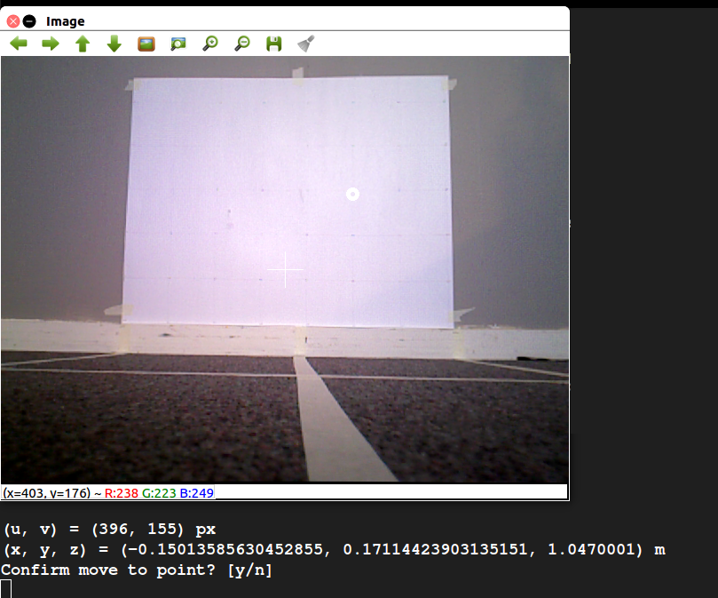

_Screenshot of the vision GUI viewing the test setup. The user has selected a point and has been asked to confirm it._

The GUI allows the user to view the Xtion’s video stream. Clicking on a point in the image displays both the pixel coordinate and the physical coordinate, calculated using the Xtion’s depth map. Luckily, ROS has a number of packages that handle the modeling of depth-sensing cameras like the Xtion, making the transformation from pixel and depth to actual coordinate fairly straightforward. Once a point is selected, the user can choose whether or not to publish it as a ROS message.

The GUI is useful in a number of ways. First, it us to test the algorithm for mapping pixel and depth readings to coordinates against the physical measurements of the test setup. This is particularly helpful when calibrating the Xtion, because it can be used to verify the accuracy of the calibration. Second, it can be used to test the vision system in conjunction with the robot arm. The user can select and publish a point, first verifying that it is a good destination for the arm’s end effector, and the arm can then attempt to move to that point. This is a core part of the pipe inspection functionality of the robot.

## Progress Updates Part 4 - March 5, 2017 - Eric Shi

Following up on the goals for reading week (Feb 20 – Feb 26):

Major Goals for Reading Week:
1. Complete machining of robot lift, robot enclosure, and supporting brackets to assemble by the February 27th
2. Complete integration of vision system with robot
3. Implementation of LIDAR safety systems and real world testing
4. Tuning of drive PID controller with load on the wheels
5. Integration and final wiring on February 27th

The project has fallen behind schedule mainly due to the machining of the robot lift, enclosure, and supporting brackets taking much longer than expected. After 11 days of an average of 8 hours of machining, the lift is done pending final tests, the robot enclosure has only a few more holes to drill, and the supporting brackets are complete. However, this heavy delay has blocked electrical work requiring the assembled robot to complete wiring.

As the team lead and project manager, I am finding it hard to keep the project on track given these delays and many courses having big deliverables around the same time. For the first time in the project, the weekly Sunday work session reserved for group work and integration is being canceled due to the busy schedule of group members and the mechanical work blocking further progress.

There are 10 more working days (not including Sunday). The new deadline for mechanical assembly has been extended to end of the day on Monday, March 6th. This is the third extension and probably the last one we can afford to do while making the symposium deadline.

Here are some updates of the mechanical components:

### Upper Enclosure Progress Update:

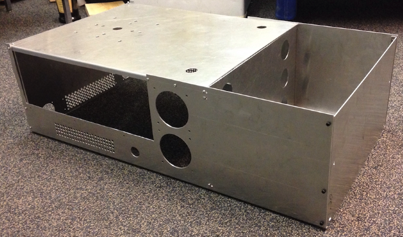

### Robot Lift Update:

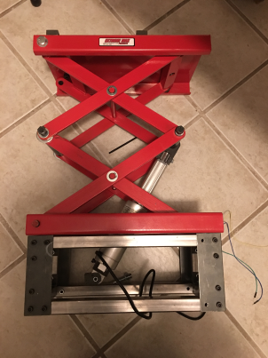

### Sensor Post Update with Temporary Platform:

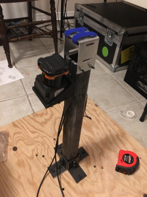

## Progress Updates Part 3 - February 26, 2017 - Eric Shi

This week was our reading week which meant that all classes were canceled and the group got to dedicate a lot more time towards the project. The team set a few major goals for reading week as follows:

Major Goals for Reading Week:
1. Complete machining of robot lift, robot enclosure, and supporting brackets to assemble by the February 27th
2. Complete integration of vision system with robot
3. Implementation of LIDAR safety systems and real world testing
4. Tuning of drive PID controller with load on the wheels
5. Integration and final wiring on February 27th

Since the individual components are more complicated, the detailed overview of each part will have their own blog posts coming up. In terms of the overall progress for each of the goals.

Condensed Updates:
1. Machining took longer than expected, even with 3 group members working on machining actively during reading week, machining of the lift, chassis, and supporting brackets have not yet been completed but it is scheduled to be completed by March 1st.
2. Vision system integration was successful with robot arm, vision system can identify a point and the robot arm motion planner creates a path to the point. Further calibration is required but the two systems are able to communicate using ROS.
3. Navigation LIDAR safety algorithms were implemented using simulations, real world testing has begun but is not complete
4. PID drive system has been tuned with load, will need to tune again once the mechanical assembly is fully complete
5. Integration is behind schedule and has not started as of Feb 27th

On the Radar:

There are three weeks left for the project, I will be watching the machining closely, the parts need to be finished by March 1st.

## Vision Tools #1: Test Environment - February 24, 2017 - Adam Heins

This is the first part in a series of posts I’m writing on the tools developed and used during the implementation of the computer vision system for the robot. The vision system is meant to be able to identify locations on pipes for the robot to measure and provide video feedback for the human operator.

One of the most fundamental parts of the vision system is the ability to map points from pixel coordinates and depth measurements obtained by our Xtion RGBD camera to actual 3D coordinates in the physical world. Luckily, much of this functionality is provided by the OpenNI2 drivers we’re using to interface with Xtion, but calibration is certainly still necessary.

To aid in calibration, I created a physical environment that allows us to place the Xtion at pre-measured physical locations. Thus, we can select a point from the Xtion’s video feed, use the software to map the point to a physical coordinate, and easily see how accurately it matches to the real physical distances to the identified location. An image of the test environment is provided below.

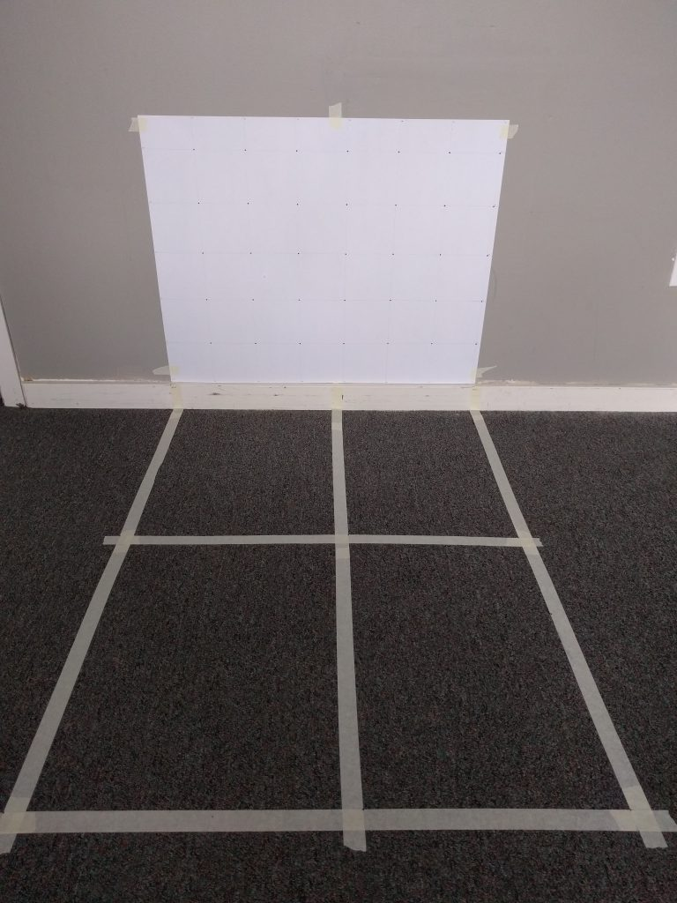

_Vision system physical test environment_

The poster board attached to the wall is marked by a grid of points arranged in 10cm squares. Lines have been put down on the floor to indicate 50cm and 100cm distances from the wall, and alignment with 0cm, 40cm, and 70cm from the left side of the grid.

The primary use of the test environment has been to validate efforts to calibrate the Xtion. I have been using the standard checkerboard calibration technique, and have been able to achieve a mapping from pixel coordinates to real-world coordinates that is quite a bit better than the default Xtion settings.

## Project Centaur Receives $1,000 from Engineer of the Future Fund - February 21, 2017 - Eric Shi

From the Engineer of the Future Trust Webpage:

“The Engineer of the Future Trust was launched by Terry Cunningham, in June 2013 on the 30th Anniversary of his graduation with a BASc (Mech, ’83) in Menlo Park, California. The President of EVault™, one of the world’s premier on-premise software and offsite cloud services for data protection and a proud ambassador for Waterloo Engineering in Silicon Valley, Terry kickstarted the Engineer of the Future Trust with a $100,000 gift and a challenge to alumni to match his donation.

With the support of our alumni in Canada and abroad, the Dean of Engineering has created a first in Canada – the Engineer of the Future Trust – a pool of discretionary micro-seed funding for budding entrepreneurs at Waterloo Engineering.”

Project Centaur has received $1,000 of funding from the Engineer of the Future Trust Fund. The team would like to thank the trust fund committee for our reviewing our application and ultimately finding interest in supporting our goals.  We will continue to work away on our first prototype and the support will go a long way.

## Simulating to Success: Using GazeboSim as a Foundation for Sensor-Related Software Development - February 14, 2017 - Rahul Rawat

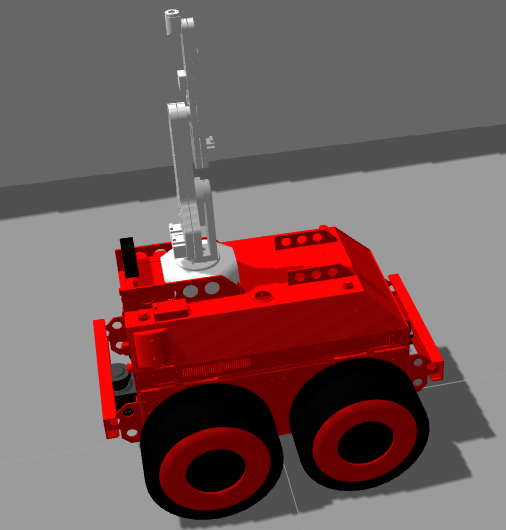

There is an age-old problem in multidisciplinary teams that require integration of software, mechanical and electrical components. The process of designing the mechanical and electrical systems often hinders the development of the software systems involved. In my experience in the University of Waterloo Mars Rover team, this is an issue I personally had faced before and was keen on avoiding during the development of Centaur.

As soon as Project Centaur was kicked-off, Wesley and I discussed using the Gazebo Sim tool provided in the standard ROS installation, such that we could simulate the mechanical apparatus and the sensor systems that will be found on the real robot. The existence of the simulated robot would allow for the parallel development of a lot of the software that will be live on our robot before the robot is actually built.

By importing the appropriate STL files and coding the physical properties of our robot using XML markup ( the language of the robot description files), we were able to produce a simulated robot in a short time span. Initially, my task was to outfit the robot with sensors that would allow the operator to move the robot in the boiler rooms without crashing into the robot and validate their positioning. It was decided that two LIDARs in the front and back of the robot would allow for accurate detection of the objects surrounding the robot. The back LIDAR specifically would safely allow for the robot to be reversed by the operator.

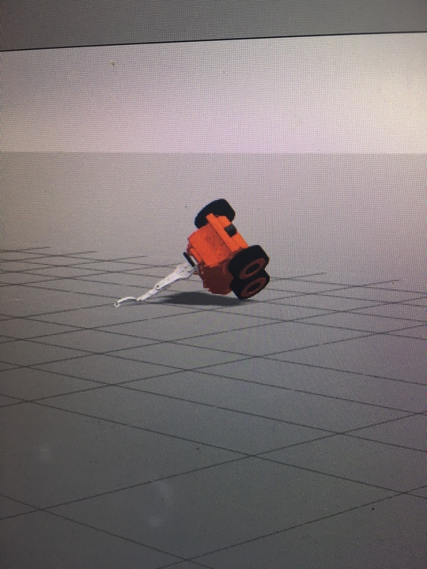

_We learned that gravity matters in simulations too_

Using the simulation and pulling the open source packages available for both the Hokuyo and the SICK-LMS, I was able to not only simulate the physical model of the sensors, but their sensory output as well. Both LIDARs were publishing the appropriate scan topics that can be used for easy interfacing with our software.

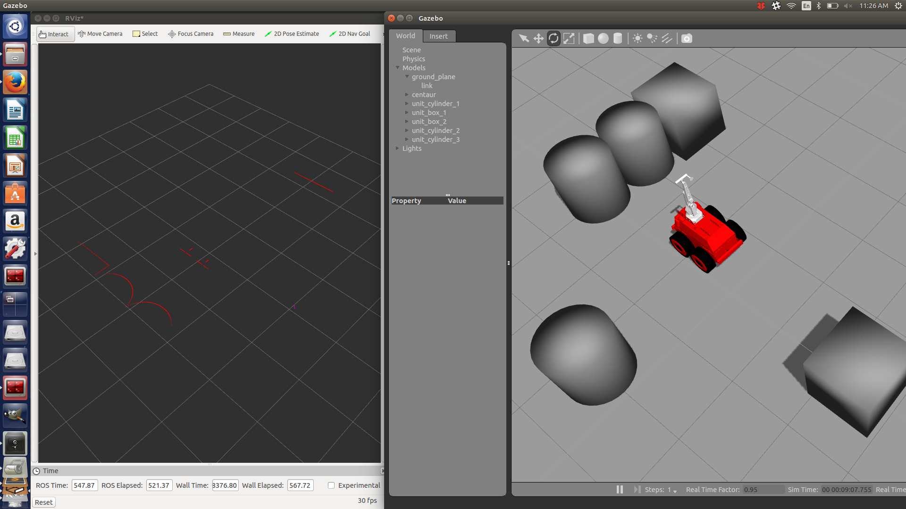

_With the simulations displaying the appropriate sensory data, it was time to start development_

Tweaking was involved originally in getting the sensors to physically appear as they would in the real robot. This required knowledge of how tf trees (short for transform trees) work in ROS. However, once the sensors were put in their appropriate placements, I was able to start working on the drive safety system that will eventually be used to override operator commands if there is a dangerous object in the way of the robot. Since the drive safety system will be heavily reliant on the front and back LIDAR data, I have been able to use the simulation to test out my code by reading simulated scan data.

For now, the simulation has served its purpose. It will often be reused when it is inconvenient to access the real robot which is constantly in development and has hence, become a handy tool to possess. With the first iteration of the drive safety system nearing completion, I look forward to implementing the safety system on the real robot.

## Progress Updates Part 2 - February 10, 2017 - Eric Shi

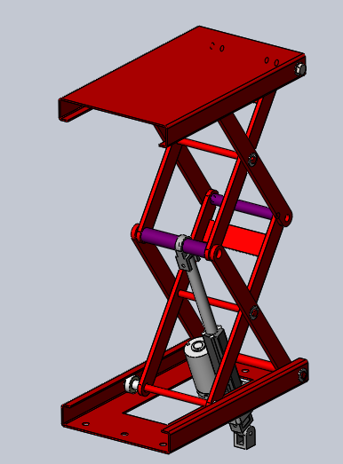

This week, the biggest task on my radar is the robot lift. The robot lift is the component that will extend the robot arm’s height by up to 60 cm. This will increase the size of Centaur’s workspace and enable it to reach more inspection points. The robot lift design has been completed and reviewed.

The robot lift utilizes a linear actuator with feedback control to raise the robotic arm during an inspection. The construction of the robot lift is required to be completed by February 25th, updates will be posted along the way.

Adam is currently working away at developing software for the vision system. A standalone test setup was created to verify the performance of the vision system under the following varied conditions:

* Different lighting
* Camera angles
* Background objects

Adam also developed a GUI to control the pan-tilt and view Xtion feed together.

Wesley is working away at fine tuning and debugging the robotic arm motion planning and control software. Software-enforced joint angle limits are being implemented to constrain the workspace of the robot arm.

I have been working on cleaning up the wiring in the motor compartment of the robot arm and implementing our charger and voltage monitors. I’ve also been looking into interfacing with our CAN bus controller from Linux.

Rahul developed a ROS node capable for receiving multiple LIDAR data channels and flagging when the close proximity of the sensors has been breached by an obstacle for the safety system.

## PID Controls, CAN Bus, and Everything Motors - February 3, 2017 - Eric Shit

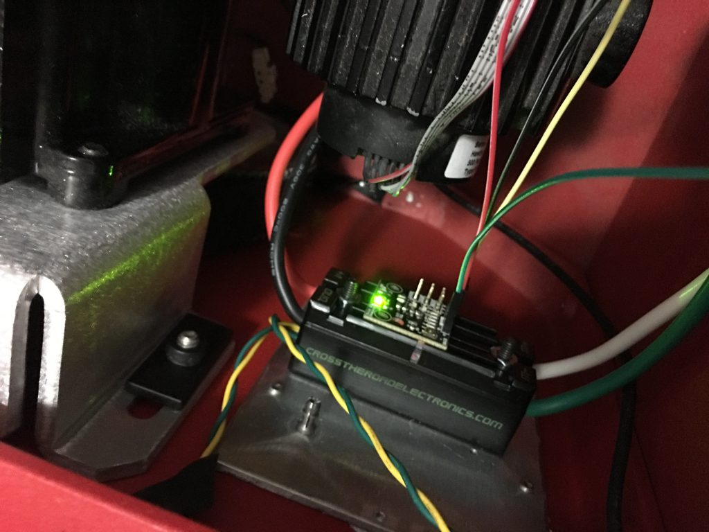

Centaur is powered using four DC motors with the following specifications

* HP: 1/4
* Volts: 24
* Gear Ratio: 11:1
* 86.9 in-lbs torque at 168 rpm

In addition the internal gearing of the DC motors, a belt mechanism is used to further gear down the output shaft to increase torque.

The main purpose of the mobile platform is to position the robot arm so that it can reach the pipes for inspection. Speed control of DC motors can be achieved using simple armature voltage control in an open-loop configuration. However, open loop speed control would make it difficult to position the robot. The robot would also not be able to reject disturbances in open loop control such as changes in floor condition. A feedforward PID controller was implemented using optical encoders as feedback.

The motor controllers used is the Talon SRX by Cross the Road Electronics. The Talons can be driven using PWM or CAN Bus. With PWM, the motor controllers work in open-loop. However, using CAN Bus, it is possible to connect encoders directly to the motor controller and implement a PID controller directly by programming the TALONs. The benefit of this is motor controls is offloaded from the main controller.

Wiring up the CAN bus was straight forward using a 120 ohm terminating resistor. The only trick was to flash the firmware on all of the Talon’s since the default firmware is for First Robotics Competition and has a token that has to be asserted every 10 seconds.

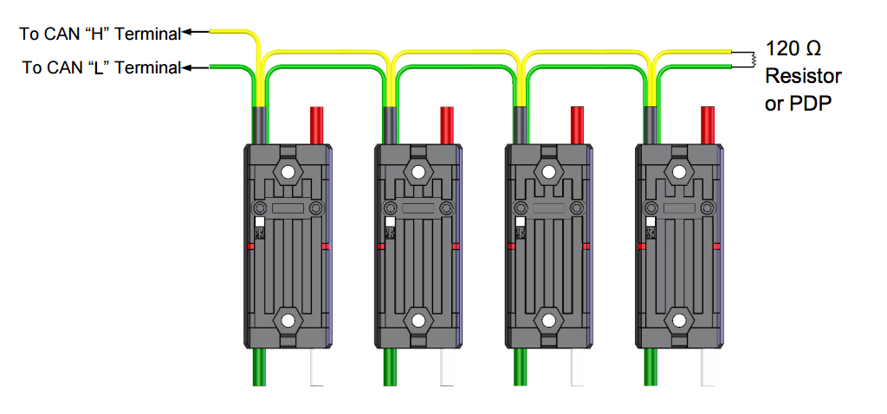

Further tuning of the PID parameters will be done later this week.

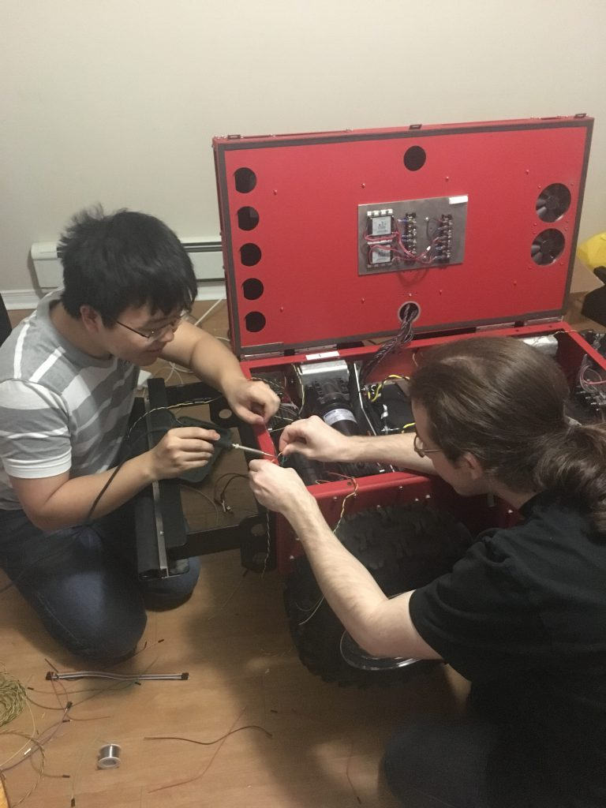

##  Progress Updates Part I - Febraury 3, 2017 - Eric Shi

The major milestone for the project is the Mechatronics design symposium on March 17th, 2017. By then it is expected that a functional prototype of Centaur is ready for public demonstration.

In the past few weeks, the team has been busy working towards a few major milestones.

* February 20th, Robot Arm and Vision System Integration
* Feb 22nd, Drive system calibration with full load
* March 1st, System integration and Testing

The goal is by March 1st, all design and construction work has been completed and the remaining time will be spent on integration and writing the software suite.

Here is a breakdown on what each team member has been working on:

* I (Eric Shi) have been working on implementing PID controls for our drive system, remote driving, setting up the onboard computer, implementing our power distribution system, wiring everything up in the drive compartment of the robot.
* Wesley Fisher has been working on developing the motion planning and simulation package for the robotic arm. He also been working on interfacing with the pipe thickness ultrasonic transducer.
* Adam Heins has been working on the vision system that will be used to guide the robot arm. Adam is working closely with Wesley in preperation of integrating the motion planning with the vision system.
* Jesse Lopes has been working on the design and fabrication of the lift mechanism for the robot arm. He is finalizing the simulations and will be machining the lift in the next week
* Rahul Rawat is simulating the algorithms that be used to help the robot navigate in a known environment using laser scanners

##  A ROS Node for the Pan-Tilt - January 29, 2017

I’m in charge of the vision system for Project Centaur. The vision system is responsible for identifying locations on pipes for the robot arm to approach and measure. To accomplish this, we are using an Xtion PRO LIVE, which is a 3D sensor similar to the Kinect. To vastly broaden our possible field of view, we decided to mount the Xtion on a pan-tilt mechanism.

The pan-tilt mechanism that we’re using is made by Robotis, and uses two Dynamixel AX-12+ motors for panning and tilting. An image of it can be seen below. My job was to get it panning and tilting via ROS commands.

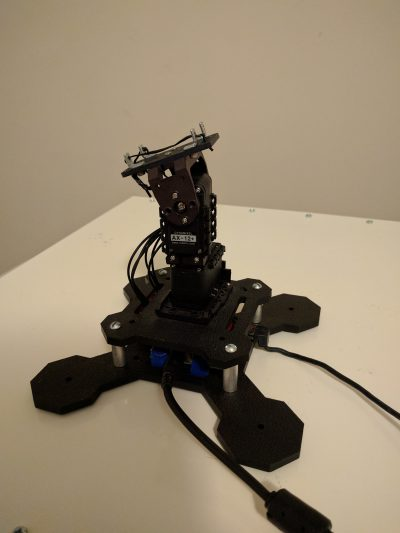

To start, I just wanted to get some sort of programmatic control working without using ROS. I found and downloaded the SDK, which is useful in that it provides bindings for many different programming languages. The only practical options here were C++ and Python, since those are what ROS (easily) supports. I chose Python because it’s much faster for prototyping and I just like it a lot better than C++.

I opened up one of the Python examples provided with the SDK. It was quite informative, but it showed that thin bindings to C functions were all the SDK provided. As such, I set out to create a much nicer Python object-oriented interface for the motor. Using my interface, one could easily initialize, shutdown, set speeds, and read and write the pan-tilt values, instead of having to directly write bytes to specific addresses on the motor controller.

With a nice interface complete, the last step was to build a ROS node on top of it. I created a simple node that publishes the pan and tilt angles, in radians, and subscribes to a Twist message for movement. This will allow us to easily integrate the pan-tilt mechanism into the overall system.

The code which I’ve written for the pan-tilt is not currently open-source, but I may post it after further testing.

## Simulation and Motion Planning with the R12 - January 21, 2017 - Wesley Fisher

Our project is using the ST Robotics R12 in order to perform thickness measurements on pipes. We plan to do this by positioning an ultrasonic sensor against those pipes, allowing thickness measurements to be read. In order to perform that sort of action, we need to have good control over the arm. And in order to test our control, we want to have a simulated model of the arm.

Since we plan on using ROS to run our project, we have several good options to do this. First of all, we have Gazebo and rviz as simulation and visualization/debugging tools. Second, the MoveIt! software package will allow us to develop motion plans for the arm.

I was able to use CAD files to create a URDF model of the R12 arm. I put this into a new package, created a Gazebo world for the arm, and created a package with ros-control plugins. With all of this done, the arm could be spawned in Gazebo and controlled over ros-control topics. The arm can also be visualised in rviz, allowing the visualisation of motion plans and other data alongside the arm.

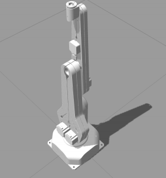

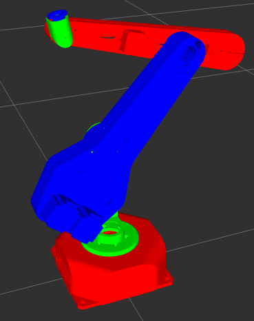

After this, I developed a MoveIt! package to control the R12. Luckily, MoveIt!’s setup assistant was able to work through most of the details of creating the original package. Once that was made, there were some problems in actually using MoveIt! to solve a motion plan. I found out after some work that this was due to the arm being a 5-DOFarm, which MoveIt!’s planning library does not support well. I was able to tweak some settings after this to get reasonable performance.

With this done, I was able to perform my first round of tests for further development. In order to reach around the pipe to gather the best data, we needed to design an end-effector to help reach around the pipe. I came up with some different conceptual designs, and created simulated models. MoveIt! was able to adapt easily to switches between them. With each of the models, I tested MoveIt!’s ability to create a motion plan to various points around a pipe, while avoiding collisions with that pipe.

Contrary to what I had expected, one of the best designs was a near-direct attachment of the probe on the end of the arm. This looks like a nice simple design that we will be implementing in the future.

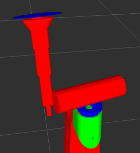

With this done, the next task will be integrating direct joint information from the R12 to ROS, as well as translating MoveIt!’s motion plans to a form that the real R12 can use and execute.

##  Interfacing with the R12 - January 20, 2017 - Adam Heins

![ST Robotics R12 arm]](r12_main.png)

The robot arm being used in our project is the ST Robotics R12. The purpose of the arm is to position an ultrasonic sensor against pipes to measure their thickness, thus checking for deterioration. The only software interface provided with the arm was a proprietary Windows client, which allows one to connect to the arm, send commands, and read the responses. However, this software did not cover our needs. The first problem was that we wanted to use ROS for the project, but ROS only runs on Linux. Second, the Windows interface did not provide an easy way to programmatically control the arm. As such, we needed to create our own solution.

Luckily, the Windows client does not do any command processing. The arm is controlled using Roboforth commands, which is a proprietary language developed by ST based on Forth. The Roboforth commands are sent as-is and processed by a microcontroller on the arm itself. The microcontroller sends the resulting signals to a separate digital signal processor which in turn drives the motors. Not having to do any command processing on the client-side, made our job quite easy. I was able to write a simple Python script to open a serial connection with the arm and provide an API to read and write to it. I also created a command-line shell program to control the arm interactively, and bundled it all into a Python package.

The Python package is now being used as a back-end for the ROS node we are developing for the arm. The code for the package is open-source, so I hope that others working with the R12 find it instructive and useful.
