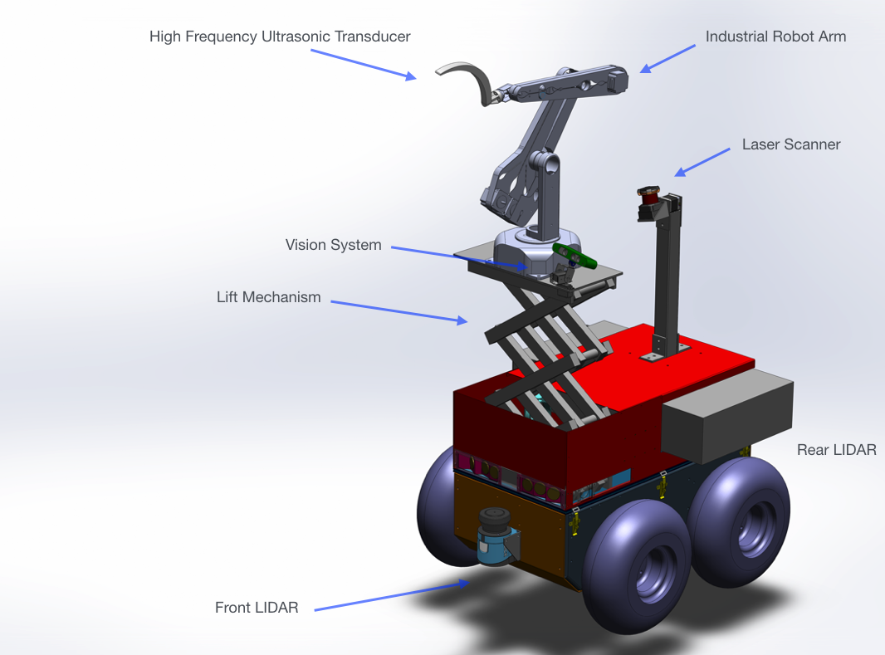
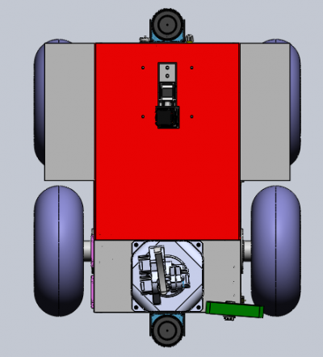
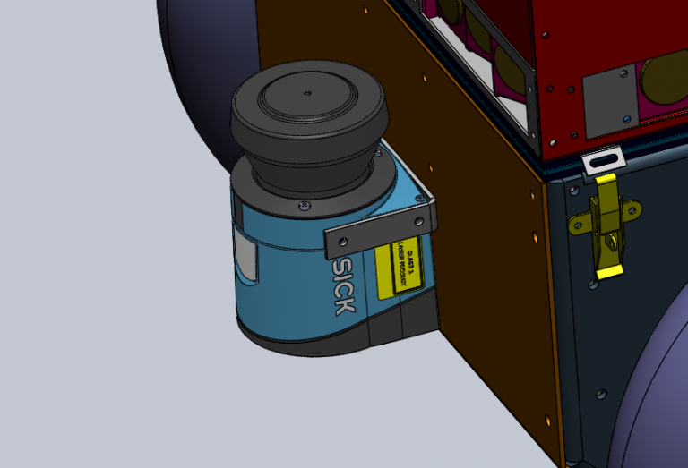
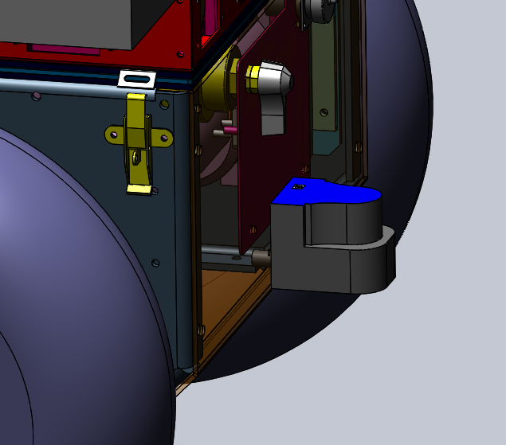
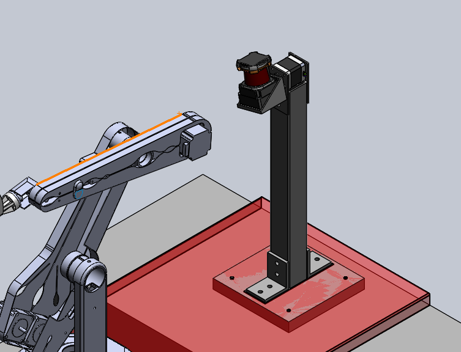

As my Mechatronics Engineering Capstone project, I worked with a group to develop a mobile robot platform with a robotic arm designed to perform automated testing activities. Our inspiration use-case was using an ultrasonic probe to inspect pipes in nuclear power plants.

I worked in a group of 5. My main area of work was in the software development and motion planning of the robot arm, ROS and Gazebo simulation development for the project, and some machining work. I also manage most of our report writing using some LaTeX report templates. Other members of our group contributed in major areas such as procuring components and sponsorships, project management, electrical design, mechanical design, and other aspects of software development.

We originally created a website for this project within my old personal WordPress site. As part of our Capstone Design course, this website was intended to serve as media for the project, and communications such as blog posts. In the future, I may add further descriptions of the development of the project.

I've copied the site contents below as best as I can, although I've left out some media and design elements.

---
---

# Project Centaur: Nuclear Power Plant Inspection Robot

## Reducing radiation exposure for workers

Nuclear power plants present hazards such as radiation exposure and heat to workers who must perform inspections within the plants. A method for performing this operations, while reducing exposure, is needed. Centaur automates the inspection process and enables higher frequency of inspection while also reducing the time workers are exposed to hazardous work environments.

## Introducing Centaur 

## So how does it work?

Worker Safety: Centaur reduces the amount of time workers need to be in hazardous environments by automating the pipe inspection process.

Long Term Operation: Centaur provides the ability for more frequent power plant inspections and better failure prediction

Failure Prediction: Centaur's software suite allows for automatic reliability and lifecycle analysis of pipes

Mapping: The robot maps the inspection room and identifies inspection points using markers.

Inspection: A 6-axis robotic arm is used to perform ultrasonic scans of pipes to record pipe thickness and to detect signs of corrosion

Lifecycle Analysis: The software enables reliability and lifecycle analysis by tracking inspection results over time to predict failure

## Thank you to our wonderful sponsors

---
---

# About

We a team of five fourth-year Mechatronics engineering students at the University of Waterloo. Together, we form the team working on Project Centaur.

We're building a mobile robot to inspect the boiler rooms of nuclear power plants. The robot is intended to perform routine maintenance tasks like temperature measurement, noise measurement, and pipe inspection. Automation of these tasks would reduce the exposure of workers to the hostile environment of the boiler room, where radiation is a concern.

## Faculty Advisors

* Dr. Sanjeev Bedi
  * Professor, PhD, PEng
  * Department of Mechanical and Mechatronics Engineering
* Dr. Baris Fidan
  * Associate Professor, PhD, PEng
  * Department of Mechanical and Mechatronics Engineering

### Overall Robot View:

### Top View:

### Navigation Sensors:

## Read-Mounted 3D Scanner

---
---

# The Team

(Updated Note: I may remove or update descriptions and links to media of team members if requested by them. I've removed personal images to avoid storing them in this website.)

## Eric Shi: Project Lead

Eric leads the team's efforts to develop an advanced mobile robot in an 8-month time span. He is experienced with robotics and also works on the robotic arm and control system for maneuvering the robot. Eric has interned at companies such as Canadian Tire, TELUS, and Apple during his University career.

## Wesley Fisher: Simulation Lead

Wesley leads work on designing a simulation of the robot and robot components for testing and design. He also works with the controls of the robot arm.

## Adam Heins: Perception Lead

Adam leads work on the vision system for pipe detection, in addition to writing a considerable amount of software to interface with and control the robot arm.

[https://adamheins.com](https://adamheins.com)

## Jesse Lopes

Jesse leads the mechanical design, which includes building, assembly and modifications to the Centaur platform.

## Rahul Rawat

Rahul leads the development of the drive and autonomy systems on the mobile robot. In addition, Rahul works on integrating sensor data into the robot and simulating the mobile system in simulation.
